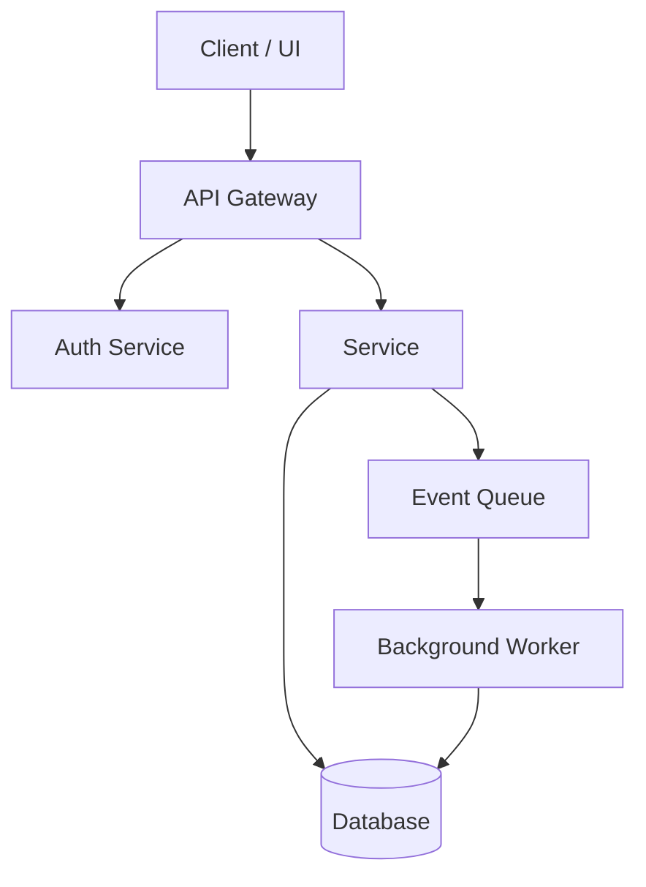
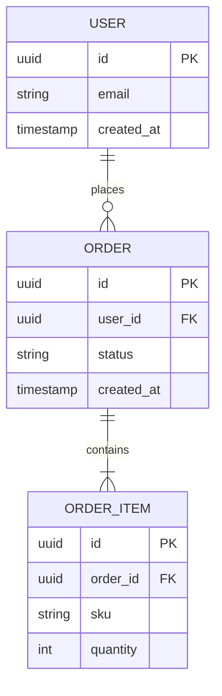
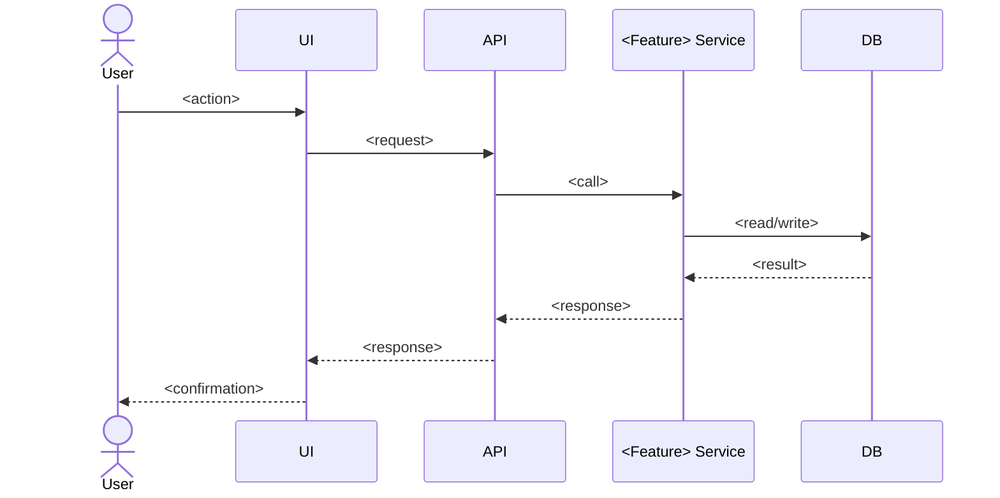
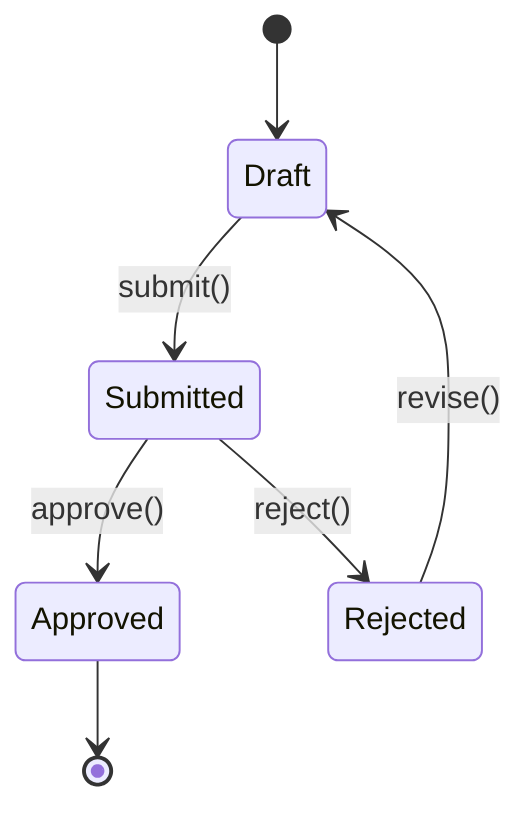

# Design: <Feature Name>

> Copy this file to `.kiro/specs/<feature-name>/design.md` (or keep it as `.kiro/specs/_template/design.md` as the org-wide starting point). Replace every `<...>` placeholder. Delete any diagram section that doesn't apply — don't leave empty Mermaid blocks.

**Status:** Draft | In Progress | Complete
**Traces to:** `requirements.md` — REQ-1, REQ-2, ... <list every requirement ID this design satisfies>
**Owner:** <team or individual>
**Last updated:** <date>

---

## 1. Overview

<Two or three sentences: what this component/feature does and why it exists. No implementation detail here — that's what the rest of the document is for.>

---

## 2. Architecture Diagram

A system/component view — what talks to what. This is the primary "pictorial" artifact reviewers look at first.



**Component notes:**
| Component | Responsibility | Satisfies |
|---|---|---|
| `<Component A>` | <one line> | REQ-<n> |
| `<Component B>` | <one line> | REQ-<n> |

---

## 3. Data Model

Entities, relationships, and cardinality. Use `erDiagram` even for a single table — it documents keys and types unambiguously.



---

## 4. Sequence Diagram(s)

One diagram per key flow named in requirements.md. Rename and duplicate this block per scenario — don't try to cram every flow into one diagram.

### 4.1 <Flow name, e.g. "User submits a refund request">



**Satisfies:** REQ-<n>

---

## 5. State Diagram (if the entity has a lifecycle)



Delete this section if the feature has no meaningful state machine.

---

## 6. UI Layout (if applicable)

Mermaid doesn't render wireframes well — use one of these instead, in order of preference:

1. **Attach an actual mockup image**: `` — export from Figma/design tool and commit it alongside this file.
2. **ASCII box layout** for simple screens, when no design tool output exists yet:

```
┌─────────────────────────────────────┐
│  <Screen Title>                  [x]│
├─────────────────────────────────────┤
│  <Field label>   [__input______]     │
│  <Field label>   [__input______]     │
│                                       │
│              [ Cancel ]  [ Submit ]  │
└─────────────────────────────────────┘
```

**Satisfies:** REQ-<n>

---

## 7. API / Interface Contract

```
POST /api/<resource>
Request:  { "<field>": "<type>", ... }
Response: 200 { "<field>": "<type>", ... }
          400 { "error": "<validation message>" }
          409 { "error": "<conflict message>" }
```

---

## 8. Error Handling

| Condition | Behavior | Satisfies |
|---|---|---|
| <invalid input> | <system response> | REQ-<n> |
| <downstream failure> | <retry/fallback behavior> | REQ-<n> |

---

## 9. Testing Strategy

State each acceptance criterion as a property Kiro can turn into a property-based test, not just a fixed example. This design follows the test pyramid: many fast unit tests, fewer integration tests, a thin layer of functional/end-to-end tests, and property-based tests wherever an invariant matters more than a single example.

### 9.1 Unit Testing

Scope: individual functions, methods, and classes in isolation — external dependencies (DB, network, filesystem, other services) are mocked or stubbed. Fast enough to run on every save.

| Component | Test File | Key Scenarios | Satisfies |
|---|---|---|---|
| `<Component A>` | `<component-a>.test.<ext>` | Happy path; each validation failure; boundary values (empty, null, max length) | REQ-<n> |
| `<Component B>` | `<component-b>.test.<ext>` | Happy path; error branch; boundary values | REQ-<n> |

**What belongs here:** business logic branches, input validation, error paths, pure functions/utilities. **What doesn't:** anything requiring a real database, network call, or another service — that's integration testing (9.2).

### 9.2 Integration Testing

Scope: verifies two or more real components work together correctly — service-to-database, service-to-queue, service-to-external-API. Use a real (or containerized/local) dependency, not a mock, so the test catches contract mismatches a unit test can't see.

| Integration Point | Test Approach | Key Scenarios | Satisfies |
|---|---|---|---|
| `<Service>` ↔ Database | Containerized test DB (e.g., Testcontainers), real queries | Write then read; constraint violations; transaction rollback | REQ-<n> |
| `<Service>` ↔ Queue | Local/test broker instance | Message published on success; message NOT published on failure | REQ-<n> |
| `<Service>` ↔ External API | Recorded fixtures (e.g., VCR-style) or a sandbox environment | Success response; timeout; 4xx/5xx from the dependency | REQ-<n> |

### 9.3 Functional Testing

Scope: validates the feature end-to-end against the acceptance criteria in `requirements.md`, exercised the way a user or caller actually would — through the API or UI, not by calling internal functions directly. This is the black-box check that the system does what REQ-\<n\> says, independent of how it's implemented internally.

| Scenario | Steps | Expected Result | Satisfies |
|---|---|---|---|
| `<Scenario name, e.g. "Submit valid refund request">` | 1. \<step\> 2. \<step\> 3. \<step\> | \<observable outcome\> | REQ-<n> |
| `<Scenario name, e.g. "Reject refund past window">` | 1. \<step\> 2. \<step\> | \<observable outcome\> | REQ-<n> |

### 9.4 Property-Based Testing

For requirements where the invariant matters more than any single example, state it as a property Kiro can turn into an executable test — not just a fixed input/output pair.

| Requirement | Property (holds for any valid input) |
|---|---|
| REQ-<n> | For any `<input type>`, `<invariant that must always hold>`. |
| REQ-<n> | For any two `<entities>`, `<relationship that must always hold>`. |

> Ask Kiro: "Run property-based tests for this spec and show me any failures" once tasks.md is generated.

### 9.5 Test Coverage

| Scope | Target | Enforced By |
|---|---|---|
| Overall line/branch coverage | ≥ `<80%>` | CI coverage gate — build fails below threshold |
| New/changed code in this feature | ≥ `<90%>` | Diff coverage check on PR |
| Business-critical paths (payments, auth, data integrity) | 100% | Manual review + required test cases listed above |
| Error-handling branches (Section 8) | 100% | Every row in the Error Handling table needs a corresponding test |

**How coverage is measured:** `<coverage tool + command, e.g. "pytest --cov, report published to CI artifact">`. Coverage percentage is a floor, not a target — a change that hits 95% coverage but skips the one branch handling a REQ-<n> edge case is not done; cross-check the coverage report against Section 8's error table and this section's scenario tables, not just the aggregate number.

### 9.6 Testing Tools

| Test Type | Tool / Framework | Stack | Notes |
|---|---|---|---|
| Unit | `<e.g. Jest, pytest, JUnit>` | `<language>` | Runs on every save via Agent Hook (Section 6 of the org Knowledge Repository guide) |
| Integration | `<e.g. Testcontainers, pytest + docker-compose>` | `<language>` | Requires local Docker or CI service containers |
| Functional / E2E | `<e.g. Playwright, Cypress, Postman/Newman>` | — | Runs against a deployed test environment, not localhost mocks |
| Property-based | `<e.g. Hypothesis (Python), fast-check (JS), QuickCheck (Haskell)>` | `<language>` | Generated inputs; failures shrink to a minimal counterexample |
| Coverage reporting | `<e.g. Codecov, Coveralls, built-in CI report>` | — | Publishes the diff-coverage check referenced in 9.5 |

---

## 10. Open Questions

- [ ] <Anything still undecided that blocks moving to tasks.md>
